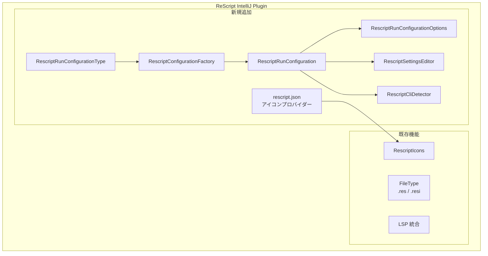
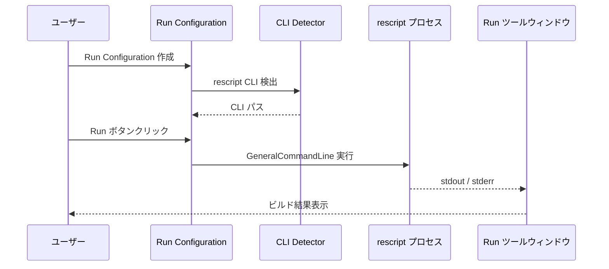

# Design: rescript.json サポート + Run Configuration

## 1. 機能概要

本機能は以下の2つのサブシステムで構成される:

1. **rescript.json ファイル認識** — `rescript.json` / `bsconfig.json` に ReScript アイコンを表示
2. **Run Configuration** — IDE 内から `rescript build` / `rescript build -w` / `rescript clean` を実行

## 2. アーキテクチャ

### 全体構成



### データフロー



## 3. コンポーネント設計

### 3.1 rescript.json アイコンプロバイダー

`rescript.json` と `bsconfig.json` に ReScript アイコンを適用する。IntelliJ の `IconProvider` を使用する。

#### RescriptJsonIconProvider

| 項目 | 内容 |
|---|---|
| 継承元 | `com.intellij.ide.IconProvider` |
| 役割 | `rescript.json` / `bsconfig.json` に ReScript アイコンを表示 |
| 登録 | `plugin.xml` の `iconProvider` |

**判定ロジック:**
- `PsiFile` の名前が `rescript.json` または `bsconfig.json` に完全一致する場合、`RescriptIcons.FILE` を返す

#### RescriptIcons への追加

既存の `RescriptIcons` オブジェクトに `CONFIG_FILE` アイコンを追加する。初回は既存の `FILE` アイコンを流用し、将来的に専用の JSON 設定アイコンに差し替え可能にする。

### 3.2 Run Configuration

IntelliJ Platform の Run Configuration フレームワークに従い、以下の5クラスを実装する。

#### RescriptRunConfigurationType

| 項目 | 内容 |
|---|---|
| 継承元 | `com.intellij.execution.configurations.ConfigurationTypeBase` |
| ID | `"RescriptRunConfiguration"` |
| 表示名 | `"ReScript"` |
| アイコン | `RescriptIcons.FILE` |
| 役割 | Run Configuration タイプの定義 |

#### RescriptConfigurationFactory

| 項目 | 内容 |
|---|---|
| 継承元 | `com.intellij.execution.configurations.ConfigurationFactory` |
| 役割 | `RescriptRunConfiguration` インスタンスの生成 |
| `getOptionsClass()` | `RescriptRunConfigurationOptions::class.java` |

#### RescriptRunConfigurationOptions

| 項目 | 内容 |
|---|---|
| 継承元 | `com.intellij.execution.configurations.RunConfigurationOptions` |
| 役割 | 設定値の永続化 |

**保存フィールド:**

| フィールド | 型 | デフォルト値 | 説明 |
|---|---|---|---|
| `command` | `String?` | `"build"` | 実行コマンド（`build` / `build-watch` / `clean`） |
| `workingDirectory` | `String?` | `null`（プロジェクトルート） | 作業ディレクトリ |
| `additionalArguments` | `String?` | `null` | 追加引数 |

#### RescriptRunConfiguration

| 項目 | 内容 |
|---|---|
| 継承元 | `com.intellij.execution.configurations.RunConfigurationBase<RescriptRunConfigurationOptions>` |
| 役割 | 設定の保持と実行プロセスの生成 |

**`getState()` の実装:**

`CommandLineState` を返す。`startProcess()` で以下のコマンドラインを構築:

| コマンド | 構築されるコマンドライン |
|---|---|
| `build` | `<rescript-path> build [追加引数]` |
| `build-watch` | `<rescript-path> build -w [追加引数]` |
| `clean` | `<rescript-path> clean [追加引数]` |

**`checkConfiguration()` の実装:**
- `rescript` CLI が見つからない場合 → `RuntimeConfigurationError`

#### RescriptSettingsEditor

| 項目 | 内容 |
|---|---|
| 継承元 | `com.intellij.openapi.options.SettingsEditor<RescriptRunConfiguration>` |
| 役割 | Run Configuration の設定 UI |

**UI レイアウト（Kotlin UI DSL v2）:**

```
┌─────────────────────────────────────────────────┐
│ Command:        [Build          ▼]              │
│ Working directory: [/path/to/project   ] [📁]   │
│ Additional arguments: [                ]         │
└─────────────────────────────────────────────────┘
```

- **Command**: ComboBox — `Build` / `Build (Watch)` / `Clean`
- **Working directory**: TextFieldWithBrowseButton — デフォルトはプロジェクトルート
- **Additional arguments**: TextField — 自由入力

### 3.3 CLI 検出ユーティリティ

#### RescriptCliDetector

| 項目 | 内容 |
|---|---|
| 型 | `object`（ユーティリティクラス） |
| 役割 | `rescript` CLI の自動検出 |

**検索順序:**

1. 指定 Working directory の `node_modules/.bin/rescript`
2. プロジェクトルートの `node_modules/.bin/rescript`
3. 親ディレクトリ走査（モノレポ対応）

この検索ロジックは既存の `RescriptLspServerDescriptor` の `findInNodeModules()` パターンに準じる。

## 4. ファイル構成

### 新規作成ファイル

```
src/main/kotlin/com/rescript/plugin/
├── config/
│   └── RescriptJsonIconProvider.kt      # rescript.json アイコン
├── run/
│   ├── RescriptRunConfigurationType.kt  # ConfigurationType
│   ├── RescriptConfigurationFactory.kt  # ConfigurationFactory
│   ├── RescriptRunConfiguration.kt      # RunConfiguration + CommandLineState
│   ├── RescriptRunConfigurationOptions.kt # 設定永続化
│   ├── RescriptSettingsEditor.kt        # 設定 UI
│   └── RescriptCliDetector.kt           # CLI 検出ユーティリティ
└── (既存ファイル)
src/main/resources/
└── icons/
    └── rescript-config.svg              # 設定ファイル用アイコン（新規）
```

### 変更ファイル

| ファイル | 変更内容 |
|---|---|
| `plugin.xml` | `iconProvider` + `configurationType` の登録追加 |
| `RescriptIcons.kt` | `CONFIG_FILE` アイコン定数の追加 |

## 5. plugin.xml 登録

```xml
<!-- rescript.json icon -->
<iconProvider
    implementation="com.rescript.plugin.config.RescriptJsonIconProvider"/>

<!-- Run Configuration -->
<configurationType
    implementation="com.rescript.plugin.run.RescriptRunConfigurationType"/>
```

## 6. 依存関係

### 既存依存のみで実装可能

- `com.intellij.execution.configurations.*` — Run Configuration フレームワーク（IntelliJ Platform 標準）
- `com.intellij.ide.IconProvider` — アイコンプロバイダー（IntelliJ Platform 標準）
- `com.intellij.ui.dsl.builder.*` — Kotlin UI DSL v2（IntelliJ Platform 標準）

追加の外部ライブラリは不要。

## 7. テスト方針

### 単体テスト

| テスト対象 | テスト内容 |
|---|---|
| `RescriptCliDetector` | CLI 検出ロジック（パス解決）のテスト |

### 手動テスト

| テスト項目 | 確認内容 |
|---|---|
| アイコン表示 | `rescript.json` / `bsconfig.json` に ReScript アイコンが表示される |
| Run Configuration 作成 | タイプ一覧に「ReScript」が表示され、設定 UI が正しく動作する |
| ビルド実行 | `rescript build` が Run ツールウィンドウで実行され、出力が表示される |
| ウォッチモード | `rescript build -w` が持続的に実行され、ファイル変更時にリビルドされる |
| クリーン | `rescript clean` が正常に実行される |
| 設定永続化 | IDE 再起動後に設定が保持されている |

## 8. 影響範囲

### 影響のあるコンポーネント

- `plugin.xml` — extension point 追加（既存機能への影響なし）
- `RescriptIcons.kt` — 定数追加のみ（既存機能への影響なし）

### 影響のないコンポーネント

- レクサー、パーサー、ハイライター、LSP 統合 — 変更なし
