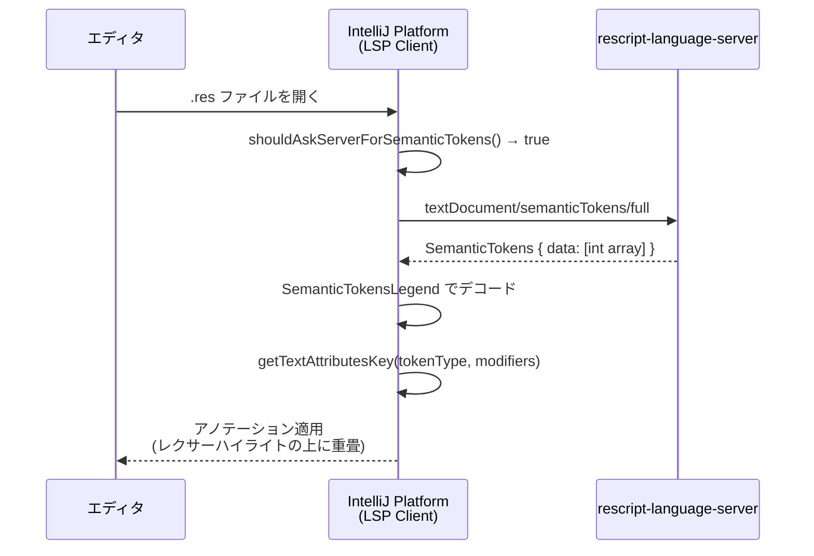

# Design: セマンティックハイライティング

## 1. 実装アプローチ

IntelliJ Platform 2025.3 の `LspSemanticTokensSupport` API を使用する。このAPIは：

- LSP サーバーへの `textDocument/semanticTokens/full` リクエストの送信
- レスポンスのデコード（整数配列 → トークン位置・タイプ）
- エディタへのハイライティング適用（アノテータ経由）

を全てプラットフォーム側で処理する。プラグイン側は **トークンタイプと `TextAttributesKey` のマッピング** を定義するだけでよい。

## 2. クラス設計

### 2.1 新規クラス: `RescriptSemanticTokensSupport`

```
パッケージ: com.rescript.plugin.lsp
ファイル: src/main/kotlin/com/rescript/plugin/lsp/RescriptSemanticTokensSupport.kt
```

```kotlin
class RescriptSemanticTokensSupport : LspSemanticTokensSupport() {

    override fun shouldAskServerForSemanticTokens(psiFile: PsiFile): Boolean {
        return true
    }

    override fun getTextAttributesKey(
        tokenType: String,
        modifiers: List<String>,
    ): TextAttributesKey? {
        return when (tokenType) {
            "variable"   -> RescriptSyntaxHighlighter.SEMANTIC_VARIABLE
            "type"       -> RescriptSyntaxHighlighter.SEMANTIC_TYPE
            "namespace"  -> RescriptSyntaxHighlighter.SEMANTIC_NAMESPACE
            "enumMember" -> RescriptSyntaxHighlighter.SEMANTIC_ENUM_MEMBER
            "property"   -> RescriptSyntaxHighlighter.SEMANTIC_PROPERTY
            "interface"  -> RescriptSyntaxHighlighter.SEMANTIC_INTERFACE
            "operator"   -> RescriptSyntaxHighlighter.SEMANTIC_OPERATOR
            "modifier"   -> RescriptSyntaxHighlighter.SEMANTIC_MODIFIER
            else         -> super.getTextAttributesKey(tokenType, modifiers)
        }
    }
}
```

**設計判断:**

- `shouldAskServerForSemanticTokens()` — デフォルト実装は `TEXT` / `textmate` 言語のみ `true` を返すため、ReScript ファイルに対して `true` を返すようオーバーライドが必須
- `getTextAttributesKey()` — 既に `RescriptSyntaxHighlighter` に定義済みの `SEMANTIC_*` キーにマッピング。レクサーハイライトの上にセマンティック情報が重畳される
- 8トークンタイプ全てにマッピングを提供。`interface`（JSX HTML要素）と `modifier`（JSX ブラケット）もセマンティック側で対応し、レクサーの `MARKUP_TAG` / `MARKUP_TAG_BRACKET` と同等の色を適用

### 2.2 既存クラスの変更: `RescriptLspServerDescriptor`

`lspCustomization` プロパティをオーバーライドして `RescriptSemanticTokensSupport` を登録する。

```kotlin
// 追加: lspCustomization プロパティ
override val lspCustomization = object : LspCustomization() {
    override val semanticTokensCustomizer = RescriptSemanticTokensSupport()
}
```

## 3. データフロー



## 4. 変更するファイル一覧

| ファイル | 変更内容 |
|---|---|
| `lsp/RescriptSemanticTokensSupport.kt` | **新規作成** — セマンティックトークンのマッピング |
| `lsp/RescriptLspServerDescriptor.kt` | **変更** — `lspCustomization` プロパティの追加（3行） |

## 5. 変更しないファイル

以下は既に対応済みのため変更不要:

| ファイル | 理由 |
|---|---|
| `highlight/RescriptSyntaxHighlighter.kt` | `SEMANTIC_*` TextAttributesKey が既に定義済み |
| `highlight/RescriptColorSettingsPage.kt` | Semantic カテゴリのデスクリプタ・デモテキストが既に定義済み |
| `colorSchemes/RescriptDefault.xml` | セマンティックトークン用のデフォルトカラーが既に定義済み |
| `colorSchemes/RescriptDarcula.xml` | 同上 |
| `plugin.xml` | LSP の extension point 登録は既存で対応済み |

## 6. レクサーハイライトとの共存

IntelliJ Platform のセマンティックハイライティングはアノテータとして動作し、レクサーベースのハイライティングの上に重畳される。

- **LSP サーバー接続時**: セマンティックトークンがレクサーハイライトを上書きし、より正確な色分けを提供
- **LSP サーバー未接続時**: レクサーベースのハイライティングがそのまま機能（フォールバック）

例: `LIDENT` トークン（レクサーでは無色）→ LSP により `variable`（青緑）や `property`（紫）に色分け

## 7. 影響範囲

- **リスク: 低** — IntelliJ Platform の公式 API のみ使用、既存のコードへの変更は最小限
- **永続的ドキュメント（`docs/`）への影響**: `functional-design.md` の LSP 統合セクションにセマンティックトークン対応の記述を追加する必要あり
- **テスト**: セマンティックハイライティングは LSP サーバーとの統合機能であり、ユニットテストよりも手動の動作確認が適切
