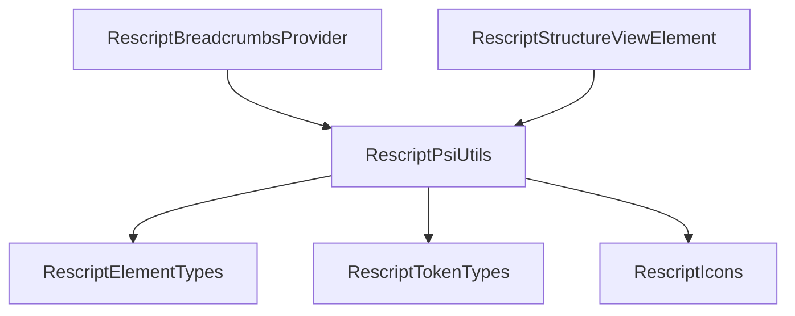

# Design: パンくずナビゲーション

## 実装アプローチ

IntelliJ Platform の `BreadcrumbsProvider` インターフェースを実装し、既存の PSI ツリーを活用してパンくずナビゲーションを提供する。

## 新規ファイル

### `src/main/kotlin/com/rescript/plugin/breadcrumb/RescriptBreadcrumbsProvider.kt`

`BreadcrumbsProvider` を実装するクラス。

```kotlin
class RescriptBreadcrumbsProvider : BreadcrumbsProvider {
    // 対象言語
    override fun getLanguages(): Array<Language> = arrayOf(RescriptLanguage)

    // パンくず対象の PSI 要素か判定
    override fun acceptElement(element: PsiElement): Boolean
    // → MODULE_DECLARATION, LET_DECLARATION, TYPE_DECLARATION,
    //   EXTERNAL_DECLARATION, EXCEPTION_DECLARATION のみ true

    // パンくず表示テキスト（宣言名）
    override fun getElementInfo(element: PsiElement): String
    // → extractName() ロジックで名前を抽出

    // アイコン表示
    override fun getElementIcon(element: PsiElement): Icon?
    // → ストラクチャービューと同じアイコンマッピング

    // ツールチップ（宣言の種類）
    override fun getElementTooltip(element: PsiElement): String?
    // → "let declaration", "module declaration" 等
}
```

## 変更ファイル

### `src/main/resources/META-INF/plugin.xml`

`breadcrumbsInfoProvider` extension point を登録:

```xml
<breadcrumbsInfoProvider
    implementation="com.rescript.plugin.breadcrumb.RescriptBreadcrumbsProvider"/>
```

## 名前抽出ロジックの共通化

現在 `RescriptStructureViewElement` に `extractName()` と `getIcon()` が `companion object` の `private` メソッドとして存在する。パンくずプロバイダーでも同じロジックが必要なため、ユーティリティオブジェクトに抽出して共有する。

### `src/main/kotlin/com/rescript/plugin/lang/psi/RescriptPsiUtils.kt`

```kotlin
object RescriptPsiUtils {
    // NAVIGABLE_TYPES セット
    val NAVIGABLE_TYPES: Set<IElementType>

    // 宣言名を抽出
    fun extractName(element: PsiElement): String

    // 宣言に対応するアイコンを返す
    fun getIcon(element: PsiElement): Icon?

    // 宣言の種類を文字列で返す（ツールチップ用）
    fun getElementDescription(element: PsiElement): String?
}
```

### `src/main/kotlin/com/rescript/plugin/structure/RescriptStructureViewElement.kt`

`extractName()` と `getIcon()` を `RescriptPsiUtils` に委譲するよう変更。

## コンポーネント関係図



## 影響範囲

- **新規**: `RescriptBreadcrumbsProvider.kt`, `RescriptPsiUtils.kt`
- **変更**: `RescriptStructureViewElement.kt`（ユーティリティ委譲）, `plugin.xml`（extension 追加）
- **影響なし**: パーサー、レクサー、LSP、その他既存機能
