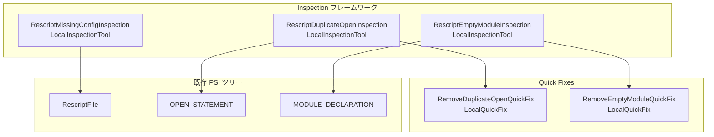

# Design: Inspections & Quick Fixes

## 1. 実装アプローチ

IntelliJ Platform の Inspection フレームワーク（`LocalInspectionTool`）を使用し、PSI ツリーベースの静的解析と Quick Fix を実装する。

### アーキテクチャ概要



## 2. コンポーネント設計

### 2.1 ファイル構成

```
src/main/kotlin/com/rescript/plugin/
└── inspection/
    ├── RescriptDuplicateOpenInspection.kt   # 重複 open 検出
    ├── RescriptEmptyModuleInspection.kt     # 空モジュール検出
    └── RescriptMissingConfigInspection.kt   # rescript.json 不在検出
```

### 2.2 RescriptDuplicateOpenInspection

| 項目 | 内容 |
|---|---|
| 継承元 | `com.intellij.codeInspection.LocalInspectionTool` |
| スコープ | ファイル単位 |
| 検査対象 | `OPEN_STATEMENT` PSI ノード |
| 重大度 | WARNING |
| Quick Fix | `RemoveDuplicateOpenQuickFix` |

**検出アルゴリズム:**

1. ファイル直下の `OPEN_STATEMENT` ノードを全て収集
2. 各ノードからモジュールパステキスト（`open` キーワード以降のテキスト）を抽出
3. 同一モジュールパスが複数回出現する場合、2つ目以降のノードに警告を登録
4. モジュール宣言内のネストした `open` は、同一 MODULE_DECLARATION スコープ内で重複判定

**モジュールパスの抽出方法:**

`OPEN_STATEMENT` ノード内のトークンから `OPEN` キーワードを除いた残りのテキスト（UIDENT, DOT トークン）を結合してモジュールパスとする。

例: `open Belt.Array` → パス = `"Belt.Array"`

**Quick Fix: RemoveDuplicateOpenQuickFix**

- `OPEN_STATEMENT` ノード全体を削除
- 削除後の空行の整理は PsiDocumentManager 経由で行わない（IntelliJ のフォーマッタに委ねる）

### 2.3 RescriptEmptyModuleInspection

| 項目 | 内容 |
|---|---|
| 継承元 | `com.intellij.codeInspection.LocalInspectionTool` |
| スコープ | ファイル単位 |
| 検査対象 | `MODULE_DECLARATION` PSI ノード |
| 重大度 | WEAK_WARNING |
| Quick Fix | `RemoveEmptyModuleQuickFix` |

**検出アルゴリズム:**

1. `MODULE_DECLARATION` ノードの子要素を走査
2. `LBRACE` と `RBRACE` の間に宣言ノード（`LET_DECLARATION`, `TYPE_DECLARATION`, `MODULE_DECLARATION` 等）が存在しない場合、空モジュールと判定
3. モジュールエイリアス（`module X = Y` — ブレースなし）は検出対象外

**判定条件:**
- `MODULE_DECLARATION` の子に `LBRACE` トークンが存在する（ブレース付きモジュール）
- かつ、子ノードに `RescriptElementTypes` で定義された宣言型が1つも存在しない

**Quick Fix: RemoveEmptyModuleQuickFix**

- `MODULE_DECLARATION` ノード全体を削除
- 直前のアノテーション（`ANNOTATION` ノード）がある場合はそれも含めて削除

### 2.4 RescriptMissingConfigInspection

| 項目 | 内容 |
|---|---|
| 継承元 | `com.intellij.codeInspection.LocalInspectionTool` |
| スコープ | ファイル単位（ただし実質的にプロジェクト単位） |
| 検査対象 | `RescriptFile` (ファイル全体) |
| 重大度 | WARNING |
| Quick Fix | なし |

**検出アルゴリズム:**

1. ファイルが ReScript ファイルであることを確認
2. プロジェクトの `basePath` を取得
3. `rescript.json` または `bsconfig.json` の存在を確認
4. どちらも存在しない場合、ファイルの先頭に警告を登録

**パフォーマンス考慮:**
- ファイルシステムアクセスを最小限に抑えるため、`VirtualFile.findChild()` を使用
- 結果はファイルの PSI 更新ごとに再評価されるが、ファイルシステムチェック自体は軽量

## 3. plugin.xml への登録

```xml
<!-- Inspections -->
<inspectionToolProvider
        implementation="com.rescript.plugin.inspection.RescriptInspectionProvider"/>
```

`InspectionToolProvider` を使って一括登録する方式ではなく、個別の `localInspection` タグで登録する:

```xml
<localInspection language="ReScript"
                 groupName="ReScript"
                 shortName="RescriptDuplicateOpen"
                 displayName="Duplicate open statement"
                 enabledByDefault="true"
                 level="WARNING"
                 implementationClass="com.rescript.plugin.inspection.RescriptDuplicateOpenInspection"/>

<localInspection language="ReScript"
                 groupName="ReScript"
                 shortName="RescriptEmptyModule"
                 displayName="Empty module declaration"
                 enabledByDefault="true"
                 level="WEAK WARNING"
                 implementationClass="com.rescript.plugin.inspection.RescriptEmptyModuleInspection"/>

<localInspection language="ReScript"
                 groupName="ReScript"
                 shortName="RescriptMissingConfig"
                 displayName="Missing rescript.json configuration"
                 enabledByDefault="true"
                 level="WARNING"
                 implementationClass="com.rescript.plugin.inspection.RescriptMissingConfigInspection"/>
```

## 4. 影響範囲

### 変更するファイル

| ファイル | 変更内容 |
|---------|---------|
| `plugin.xml` | `localInspection` タグ 3件追加 |

### 新規作成するファイル

| ファイル | 内容 |
|---------|------|
| `inspection/RescriptDuplicateOpenInspection.kt` | 重複 open 検出 + Quick Fix |
| `inspection/RescriptEmptyModuleInspection.kt` | 空モジュール検出 + Quick Fix |
| `inspection/RescriptMissingConfigInspection.kt` | rescript.json 不在検出 |

### 変更しないファイル

- `Rescript.flex` — レクサーの変更は不要
- `RescriptTokenTypes.kt` — 新しいトークンは不要
- `RescriptParser.kt` — パーサーの変更は不要（既存 PSI 構造で十分）
- `RescriptPsi.kt` — 新しい要素型は不要

## 5. テスト方針

- `./gradlew buildPlugin` によるビルド成功を確認
- 手動テストシナリオ:
  - 同一モジュールの `open` を2回書いて警告が出ることを確認
  - 空の `module Foo = {}` で弱い警告が出ることを確認
  - `rescript.json` がないプロジェクトで `.res` ファイルを開き、警告が出ることを確認
  - 各 Quick Fix が正しく動作することを確認
  - Settings > Editor > Inspections > ReScript で設定変更が反映されることを確認
