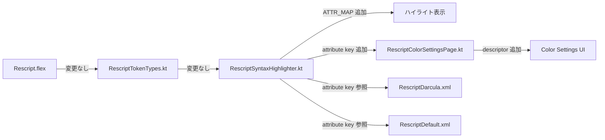

# Design: パターンマッチングハイライト

## 実装アプローチ

既存の 4 トークン（`PIPE`, `UNDERSCORE`, `DOTDOTDOT`, `SHORTCUT`）は既にレクサーで認識されているが、`RescriptSyntaxHighlighter` の `ATTR_MAP` に未登録のため色が付かない。これらを適切な TextAttributesKey にマッピングし、カラースキームとカラー設定ページを更新する。

## 変更コンポーネント

### 1. RescriptSyntaxHighlighter.kt

新規 TextAttributesKey を 2 つ追加し、ATTR_MAP に 4 トークンを登録する：

```kotlin
// 新規 attribute keys
val PATTERN_PIPE = createTextAttributesKey("RESCRIPT_PATTERN_PIPE", Defaults.KEYWORD)
val WILDCARD = createTextAttributesKey("RESCRIPT_WILDCARD", Defaults.KEYWORD)

// ATTR_MAP への追加
put(T.PIPE, arrayOf(PATTERN_PIPE))        // | パターンアーム / バリアント宣言
put(T.UNDERSCORE, arrayOf(WILDCARD))       // _ ワイルドカード
put(T.DOTDOTDOT, arrayOf(OPERATOR))        // ... スプレッド（既存の OPERATOR を利用）
put(T.SHORTCUT, arrayOf(OPERATOR))         // :: リスト cons（既存の OPERATOR を利用）
```

**設計判断**:
- `|` と `_` は ReScript において特別な意味を持つため、独自の TextAttributesKey を付与。ユーザーが個別にカスタマイズ可能にする
- `...` と `::` は演算子の一種であるため、既存の `OPERATOR` を再利用する。独自キーは不要
- `|` のデフォルトフォールバックは `KEYWORD`（パターンアームの構造を強調するため）
- `_` のデフォルトフォールバックは `KEYWORD`（キャッチオールの重要性を視覚的に示すため）

### 2. RescriptColorSettingsPage.kt

LEXER_DESCRIPTORS に 2 項目を追加：

```kotlin
AttributesDescriptor("Pattern//Pipe (|)", RescriptSyntaxHighlighter.PATTERN_PIPE),
AttributesDescriptor("Pattern//Wildcard (_)", RescriptSyntaxHighlighter.WILDCARD),
```

デモテキストにパターンマッチングの例を追加（タグ付きハイライト不要 — レクサーベースのトークンなので自動適用される）：

```rescript
// 既存の switch 部分を拡充
let result = switch color {
| Red => "red"
| Green => "green"
| _ => "other"
}
```

### 3. RescriptDarcula.xml

```xml
<!-- Pattern pipe (|) - purple (keyword-like, matches One Dark theme) -->
<option name="RESCRIPT_PATTERN_PIPE">
    <value>
        <option name="FOREGROUND" value="C678DD"/>
    </value>
</option>

<!-- Wildcard (_) - purple (keyword-like) -->
<option name="RESCRIPT_WILDCARD">
    <value>
        <option name="FOREGROUND" value="C678DD"/>
    </value>
</option>
```

### 4. RescriptDefault.xml

```xml
<!-- Pattern pipe (|) - purple (keyword-like) -->
<option name="RESCRIPT_PATTERN_PIPE">
    <value>
        <option name="FOREGROUND" value="800080"/>
    </value>
</option>

<!-- Wildcard (_) - purple (keyword-like) -->
<option name="RESCRIPT_WILDCARD">
    <value>
        <option name="FOREGROUND" value="800080"/>
    </value>
</option>
```

**色の選定理由**:
- Darcula: `C678DD`（紫）— One Dark テーマのキーワード色と統一。パイプとワイルドカードがキーワードと同程度の重要性を持つことを視覚的に示す
- Default: `800080`（紫）— Default テーマの Type argument と同系色。キーワードに近い印象を与える

## 影響範囲



| ファイル | 変更内容 | リスク |
|---------|---------|-------|
| `RescriptSyntaxHighlighter.kt` | attribute key 2 追加 + ATTR_MAP 4 エントリ追加 | 低 |
| `RescriptColorSettingsPage.kt` | descriptor 2 追加 + デモテキスト更新 | 低 |
| `RescriptDarcula.xml` | カラー定義 2 追加 | 低 |
| `RescriptDefault.xml` | カラー定義 2 追加 | 低 |

## リスク分析

- **リスク**: 既存テストへの影響 → **対策**: ATTR_MAP 追加のみで既存マッピングに変更なし。レグレッションリスクは極めて低い
- **リスク**: カラースキームの互換性 → **対策**: 新規キーのみ追加。既存キーへの変更なし
