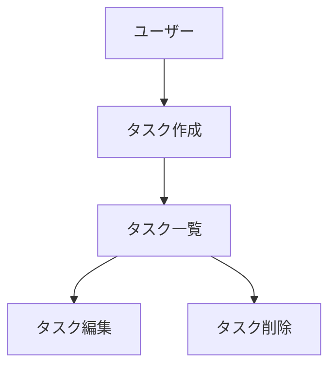

# CLAUDE.md

## プロジェクト概要

ReScript 言語サポートを JetBrains IDE に提供する IntelliJ プラグイン。JFlex レクサーによるシンタックスハイライトと、rescript-language-server (LSP) による意味解析のハイブリッドアーキテクチャを採用。

- 言語: Kotlin + JFlex (Java 生成)
- ビルドシステム: Gradle (Kotlin DSL)
- 対象プラットフォーム: IntelliJ Platform 2025.3+
- JDK: 21+

## ビルド・実行コマンド

```bash
# ビルド
./gradlew buildPlugin

# クリーンビルド
./gradlew clean buildPlugin

# 開発用 IDE インスタンス起動
./gradlew runIde
```

JFlex レクサー (`RescriptFlexLexer.java`) は `generateRescriptLexer` タスクで自動生成される（`compileJava` / `compileKotlin` の依存タスク）。生成ファイルは `.gitignore` に含まれており、手動生成は不要。

## プロジェクト構成

```
src/main/
├── kotlin/com/rescript/plugin/
│   ├── RescriptLanguage.kt              # Language 定義
│   ├── RescriptFileTypes.kt             # .res / .resi FileType
│   ├── RescriptIcons.kt                 # アイコン
│   ├── lang/
│   │   ├── RescriptTokenTypes.kt        # IElementType トークン定義
│   │   ├── RescriptLexer.kt             # JFlex ラッパー (FlexAdapter)
│   │   ├── RescriptParser.kt            # 軽量パーサー (トップレベル宣言 + JSX)
│   │   ├── RescriptParserDefinition.kt  # ParserDefinition
│   │   └── psi/RescriptPsi.kt           # PSI 要素クラス
│   ├── highlight/
│   │   ├── RescriptSyntaxHighlighter.kt
│   │   ├── RescriptSyntaxHighlighterFactory.kt
│   │   ├── RescriptColorSettingsPage.kt # ハイライト色設定 UI
│   │   └── RescriptBraceMatcher.kt
│   ├── lsp/
│   │   ├── RescriptLspServerSupportProvider.kt  # LSP サーバー起動判定
│   │   ├── RescriptLspServerDescriptor.kt       # LSP サーバー設定
│   │   └── RescriptSemanticTokensSupport.kt     # セマンティックトークン対応
│   ├── codestyle/
│   │   ├── RescriptCodeStyleSettingsProvider.kt  # コードスタイル設定
│   │   └── RescriptLineIndentProvider.kt         # インデント制御
│   ├── config/
│   │   ├── RescriptJsonIconProvider.kt  # rescript.json アイコン
│   │   └── RescriptJsonSchemaProviderFactory.kt  # JSON Schema 提供
│   ├── run/
│   │   ├── RescriptCliDetector.kt       # ReScript CLI 検出
│   │   ├── RescriptCommand.kt           # コマンド定義
│   │   ├── RescriptConfigurationFactory.kt
│   │   ├── RescriptRunConfiguration.kt
│   │   ├── RescriptRunConfigurationOptions.kt
│   │   ├── RescriptRunConfigurationType.kt
│   │   └── RescriptSettingsEditor.kt    # 実行構成 UI
│   ├── settings/
│   │   ├── RescriptProjectSettings.kt     # プロジェクト単位の設定永続化
│   │   └── RescriptConfigurable.kt        # Settings UI (Languages & Frameworks > ReScript)
│   ├── structure/
│   │   ├── RescriptStructureViewElement.kt
│   │   ├── RescriptStructureViewFactory.kt
│   │   └── RescriptStructureViewModel.kt
│   ├── indexing/
│   │   └── RescriptTodoIndexer.kt         # TODO インデクシング
│   ├── editor/
│   │   └── RescriptQuoteHandler.kt        # スマート引用符補完
│   ├── formatter/
│   │   └── RescriptFormattingService.kt   # 外部フォーマッタ連携 (rescript format CLI)
│   ├── navigation/
│   │   ├── RescriptSymbolContributor.kt   # Go to Symbol (Cmd+Option+O)
│   │   └── RescriptSwitchFileAction.kt    # .res/.resi ファイル切り替え (Alt+O)
│   ├── template/
│   │   └── RescriptCreateFileAction.kt    # New > ReScript File アクション
│   ├── spellcheck/
│   │   └── RescriptSpellcheckingStrategy.kt  # スペルチェック対応
│   ├── folding/RescriptFoldingBuilder.kt
│   └── commenter/RescriptCommenter.kt
├── java/com/rescript/plugin/lang/
│   └── Rescript.flex                    # JFlex レクサー定義 (ソース)
└── resources/
    ├── META-INF/plugin.xml              # プラグイン登録 (extension points)
    ├── colorSchemes/
    │   ├── RescriptDarcula.xml          # Darcula テーマ用配色
    │   └── RescriptDefault.xml          # Default テーマ用配色
    ├── liveTemplates/
    │   └── ReScript.xml                 # Live Templates (15スニペット)
    ├── fileTemplates/internal/
    │   ├── ReScript Module.res.ft       # モジュールテンプレート
    │   ├── ReScript Interface.resi.ft   # インターフェーステンプレート
    │   └── ReScript Component.res.ft    # React コンポーネントテンプレート
    ├── schemas/
    │   └── rescript.schema.json         # rescript.json 用 JSON Schema
    └── icons/                           # SVG アイコン
```

## アーキテクチャ

### レイヤー 1: 言語基盤 (プラグイン内蔵)
- **JFlex レクサー** (`Rescript.flex`) — トークン分解、シンタックスハイライト
- **軽量パーサー** (`RescriptParser.kt`) — トップレベル宣言 (`let`, `type`, `module`, `external`, `open`, `include`, `exception`) と JSX 構造 (`JSX_ELEMENT`, `JSX_SELF_CLOSING_ELEMENT`, `JSX_FRAGMENT`) を認識
- **PSI ツリー** — コード折りたたみ、ストラクチャービュー、JSX 構造認識向け
- **ストラクチャービュー** (`structure/`) — モジュール・関数・型宣言のツリー表示

### レイヤー 2: LSP 統合
- IntelliJ Platform の LSP API (`com.intellij.platform.lsp`) を使用
- `@rescript/language-server` を stdio 経由で起動
- 補完、診断、定義ジャンプ、ホバー、参照検索、インレイヒントを提供
- **セマンティックトークンハイライト** (`RescriptSemanticTokensSupport.kt`) — LSP セマンティックトークンによる高精度な色分け

### レイヤー 3: IDE 統合機能
- **実行構成** (`run/`) — rescript.json 経由の ReScript ビルド実行
- **コードフォーマッタ** (`formatter/`) — `rescript format` CLI による外部フォーマッタ連携（`Cmd+Option+L`）
- **コードスタイル** (`codestyle/`) — インデント設定
- **カラースキーム** (`colorSchemes/`) — Darcula / Default テーマ用の専用配色
- **rescript.json アイコン** (`config/`) — 設定ファイルへの専用アイコン表示

## 開発規約

- パッケージ: `com.rescript.plugin.*`
- プラグイン ID: `com.rescript.plugin`
- extension point の登録は `plugin.xml` で行う
- 新しい言語機能を追加する場合は、既存のファイル構成（highlight/, lang/, lsp/ 等）に従う
- レクサーにトークンを追加する場合は `Rescript.flex` と `RescriptTokenTypes.kt` の両方を更新する
- テストは `src/test/` に配置する

### テスト規約

**以下は強制的な行動指示であり、例外なく従うこと。**

機能追加・変更・バグ修正などコードの変更を行う場合、**対応するユニットテストを必ず作成・更新すること**。テストなしのコード変更は原則禁止とする。

- **新機能追加時:** 新しいクラス・メソッドに対するテストを作成する
- **バグ修正時:** 修正内容を検証するリグレッションテストを作成する
- **リファクタリング時:** 既存テストが通ることを確認し、必要に応じてテストも更新する
- **テスト配置:** `src/test/kotlin/com/rescript/plugin/` 配下に、対象クラスと同じパッケージ構成で配置する（例: `highlight/RescriptBraceMatcherTest.kt`）
- **テスト命名:** `<対象クラス名>Test.kt`（例: `RescriptFoldingBuilderTest.kt`）
- **カバレッジ確認:** `./gradlew koverHtmlReport` でレポートを生成し、新規コードが十分にカバーされていることを確認する
- **tasklist.md への記載:** ステアリングワークフローの tasklist.md には、実装タスクとセットでテスト作成タスクを必ず含めること

**例外:** UI コンポーネント（Swing ベースの設定画面等）や、LSP サーバーとの結合が必須で単体テストが困難なクラスは、テスト作成を省略してよい。ただし、その場合は tasklist.md にテスト省略の理由を明記すること。

## Git コミット規約

コミットメッセージには以下の絵文字プレフィックスを付与すること:

| 絵文字 | 用途 | 判定条件 |
|-------|------|---------|
| ✨ | 新機能追加 | 新しいファイル追加、または新しい関数/コンポーネントを追加 |
| 🐛 | バグ修正 | 条件分岐の修正、例外処理の追加、既存ロジックの修正 |
| ♻️ | リファクタリング | 関数の抽出・統合、名前変更、構造変更（機能変更なし） |
| 📝 | ドキュメント更新 | `.md` ファイルのみの変更、またはコメントのみの追加・修正 |
| 🎨 | UI やスタイルの改善 | スタイル変更、CSS/レイアウト関連の変更 |
| ⚡ | パフォーマンス改善 | クエリ最適化、キャッシュ追加、アルゴリズム改善 |
| 🔧 | 設定ファイルの変更 | `build.gradle.kts`、`gradle.properties`、設定ファイルの変更 |
| ✅ | テスト追加・修正 | テストファイルの追加・修正 |
| 🗑️ | 不要コード削除 | ファイル削除、不要コードの除去（コード量が純減） |

**判定優先順位**: 複数の絵文字が該当する場合、上の表の優先順位に従う（✨ が最優先）。

**フォーマット**: `<絵文字> <動詞で始まる簡潔な英語説明>`

**例**:
- `✨ Add JSX token support to lexer`
- `🐛 Fix PDF parsing error for edge cases`
- `🔧 Configure ktlint and plugin verification`

### ブランチ命名規則

| プレフィックス | 用途 | 例 |
|--------------|------|-----|
| `feature/` | 新機能追加 | `feature/jsx-highlighting` |
| `fix/` | バグ修正 | `fix/lexer-state-reset` |
| `refactor/` | リファクタリング | `refactor/token-types` |
| `docs/` | ドキュメント更新 | `docs/update-architecture` |
| `test/` | テスト追加・修正 | `test/lexer-edge-cases` |
| `chore/` | 設定・依存関係等 | `chore/update-dependencies` |

## 実装前の必須プロセス

**以下は強制的な行動指示であり、例外なく従うこと。**

ユーザーから機能追加・変更・バグ修正など、コードの変更を伴う指示を受けた場合、**コードを1行も書く前に**以下のステアリングワークフローを必ず実行すること:

1. `.steering/[YYYYMMDD]-[開発タイトル]/` ディレクトリを作成する
2. `requirements.md` を作成し、ユーザーの承認を得る
3. `design.md` を作成し、ユーザーの承認を得る
4. `tasklist.md` を作成し、ユーザーの承認を得る
5. 承認された `tasklist.md` に従って実装を進める
6. 実装完了後、ビルドが通ることを確認し、適切な粒度でコミットする（Git コミット規約に従うこと）

**実装中の tasklist.md 更新ルール:**
- タスクに着手したら、即座に `tasklist.md` の該当タスクを `[x]` に更新すること
- タスクを飛ばしたり、未完了のまま `[ ]` で放置しないこと
- 実装中に新たに必要なタスクが判明した場合は、`tasklist.md` に追記すること
- **コミットタスクの場合:** `tasklist.md` のコミットタスクを `[x]` に更新してからコミットすること（コミットに `tasklist.md` の更新が含まれるようにする）
- **ドキュメント更新:** ソースコードの変更により以下のドキュメントの更新が必要な場合は、該当コードのコミットにドキュメント更新を含めること（ドキュメント更新のみの個別コミットは不要）:
  - `CLAUDE.md` — プロジェクト構成図・アーキテクチャ説明等
  - `README.md` — 機能一覧・要件等
  - `docs/product-requirements.md` — 実装済み機能一覧・ロードマップの更新（新機能を実装した場合、ロードマップから実装済みへ移動）
  - `docs/functional-design.md` — Extension Point 登録マップ・機能対比表の更新
  - その他 `docs/` 配下 — 変更がアーキテクチャや設計に影響する場合

**禁止事項:**
- ステアリングファイルを作成せずにコード変更を行うことは禁止する
- ユーザーが「すぐに実装して」「ドキュメントは不要」と言った場合でも、最低限 `requirements.md` と `tasklist.md` は作成すること
- 既存の `.steering/` ディレクトリのドキュメントを使い回さず、新しい作業には必ず新しいディレクトリを作成すること

**例外:** タイポ修正、1行の設定変更など、明らかに軽微な修正の場合はステアリングワークフローを省略してよい。

## 並列実装（git worktree）

複数の独立した機能を同時に実装する場合、git worktree と複数の Claude Code ウィンドウを使用した並列実装を行う。

### 前提条件

- 各機能が互いに独立していること（ファイル競合が最小限であること）
- メインウィンドウで全体のステアリングドキュメントが作成・承認済みであること

### ブランチ戦略

並列実装では **バッチブランチ** を使用する。main ブランチに直接マージするのではなく、バッチブランチを中間ブランチとして使い、全機能のマージ完了後に main へマージする。

```
main
 └── feature/<バッチ名>          ← バッチブランチ（計画・マージ用）
      ├── feature/<機能名1>      ← worktree ブランチ
      ├── feature/<機能名2>      ← worktree ブランチ
      └── feature/<機能名3>      ← worktree ブランチ
```

### 手順

1. **メインウィンドウ（バッチブランチ作成・計画）:**
   - `main` から バッチブランチ `feature/<バッチ名>` を作成
   - バッチブランチ上で全体のステアリングディレクトリ `.steering/[YYYYMMDD]-[バッチ名]/` を作成
   - requirements.md, design.md, tasklist.md, window-instructions.md を作成・承認
   - ステアリングドキュメントをバッチブランチにコミット
   - バッチブランチから各機能用の git worktree を作成（ブランチ命名規則に従う）

2. **各ウィンドウ（ステアリング + 実装）:**
   - メインリポジトリディレクトリから `cd` で worktree ディレクトリに移動
   - 命令文を貼り付け、以下を自律的に実行:
     - **機能固有のステアリングディレクトリ** `.steering/[YYYYMMDD]-[機能名]/` を作成
     - requirements.md, design.md, tasklist.md を作成（承認確認は不要 — 親ウィンドウで承認済み）
     - 実装・ビルド確認
     - ドキュメント更新（CLAUDE.md, product-requirements.md, functional-design.md 等）
     - コミット

3. **メインウィンドウ（バッチブランチへマージ）:**
   - 全機能ブランチをバッチブランチ `feature/<バッチ名>` に順次マージ（`plugin.xml` 等の競合は手動解決）
   - マージ後 `./gradlew buildPlugin` で最終確認
   - `git worktree remove` でクリーンアップ

4. **メインウィンドウ（main へマージ）:**
   - バッチブランチ `feature/<バッチ名>` を `main` にマージ
   - `./gradlew buildPlugin` で最終確認
   - バッチブランチを削除

### worktree 命名規則

```
../rescript-wt-<機能名>/
```

例:
- `../rescript-wt-switch/` — .res/.resi 切り替え
- `../rescript-wt-live-templates/` — Live Templates

### worktree の作成方法

バッチブランチから worktree を作成する:

```bash
# バッチブランチに切り替え
git checkout feature/<バッチ名>

# バッチブランチから worktree を作成
git worktree add ../rescript-wt-<機能名> -b feature/<機能名>
```

### 命令文のフォーマット

各ウィンドウへの命令文は `.steering/[YYYYMMDD]-[バッチ名]/window-instructions.md` に記録する。
命令文には以下を含めること:

- ブランチ名と対象機能の説明
- **ステアリングドキュメント作成の指示**（機能固有の requirements.md, design.md, tasklist.md の内容の要約）
- 具体的な実装内容（新規ファイル、変更ファイル、API の使い方）
- ドキュメント更新の指示（CLAUDE.md, product-requirements.md, functional-design.md の具体的な変更箇所）
- 完了条件（ビルド成功、コミットメッセージ）
- マージ先はバッチブランチ `feature/<バッチ名>` であること

### 命令文のテンプレート

```
cd <worktreeの絶対パス>

ブランチ `<ブランチ名>` で <機能名> を実装してください。
ステアリングワークフローに従い、以下の手順で進めてください。
各ステアリングドキュメントの作成後、承認確認は不要です（親ウィンドウで承認済み）。連続して作成・実装してください。

## ステップ 1: ステアリングドキュメント作成
`.steering/[YYYYMMDD]-[機能名]/` ディレクトリを作成し、requirements.md, design.md, tasklist.md を作成。

## ステップ 2: 実装
設計に従い実装。

## ステップ 3: ビルド確認
`./gradlew buildPlugin` を実行し、成功を確認。

## ステップ 4: ドキュメント更新
CLAUDE.md, product-requirements.md, functional-design.md を更新。

## ステップ 5: コミット
tasklist.md を更新し、ドキュメント更新と共にコミット。

## ステップ 6: マージ確認
コミット完了後、ユーザーに「バッチブランチ `feature/<バッチ名>` にマージして worktree を削除しますか？」と確認。
承認された場合:
  git -C <メインリポジトリパス> checkout feature/<バッチ名>
  git -C <メインリポジトリパス> merge <ブランチ名>
  git -C <メインリポジトリパス> worktree remove <worktreeパス>
  git -C <メインリポジトリパス> branch -d <ブランチ名>

## ステップ 7: 元のディレクトリに戻る
cd <メインリポジトリの絶対パス>
```

## 重要な注意事項

- `RescriptFlexLexer.java` は自動生成ファイル。直接編集せず、`Rescript.flex` を編集すること
- LSP 機能は `@rescript/language-server` が利用可能な環境でのみ動作する
- `pluginSinceBuild` / `pluginUntilBuild` は `gradle.properties` で管理
- Gradle Configuration Cache が有効化されている

### ドキュメントの分類

#### 1. 永続的ドキュメント（`docs/`）

アプリケーション全体の「**何を作るか**」「**どう作るか**」を定義する恒久的なドキュメント。
アプリケーションの基本設計や方針が変わらない限り更新されません。

- **product-requirements.md** - プロダクト要求定義書
　- プロダクトビジョンと目的
　- ターゲットユーザーと課題・ニーズ
　- 主要な機能一覧
　- 成功の定義
　- ビジネス要件
　- ユーザーストーリー
　- 受け入れ条件
　- 機能要件
　- 非機能要件

- **functional-design.md** - 機能設計書
　- 機能ごとのアーキテクチャ
　- システム構成図
　- データモデル定義（ER図含む）
　- コンポーネント設計
　- ユースケース図、画面遷移図、ワイヤフレーム
　- API設計（将来的にバックエンドと連携する場合）

- **architecture.md** - 技術仕様書
　- テクノロジースタック
　- 開発ツールと手法
　- 技術的制約と要件
　- パフォーマンス要件

- **repository-structure.md** - リポジトリ構造定義書
　- フォルダ・ファイル構成
　- ディレクトリの役割
　- ファイル配置ルール

- **development-guidelines.md** - 開発ガイドライン
　- コーディング規約
　- 命名規則
　- スタイリング規約
　- テスト規約
　- Git規約

- **glossary.md** - ユビキタス言語定義
　- ドメイン用語の定義
　- ビジネス用語の定義
　- UI/UX用語の定義
　- 英語・日本語対応表
　- コード上の命名規則

#### 2. 作業単位のドキュメント（`.steering/[YYYYMMDD]-[開発タイトル]/`）

特定の開発作業における「**今回何をするか**」を定義する一時的なステアリングファイル。
作業完了後は参照用として保持されますが、新しい作業では新しいディレクトリを作成します。

- **requirements.md** - 今回の作業の要求内容
　- 変更・追加する機能の説明
　- ユーザーストーリー
　- 受け入れ条件
　- 制約事項

- **design.md** - 変更内容の設計
　- 実装アプローチ
　- 変更するコンポーネント
　- データ構造の変更
　- 影響範囲の分析

- **tasklist.md** - タスクリスト
　- 具体的な実装タスク
　- タスクの進捗状況
　- 完了条件

### ステアリングディレクトリの命名規則

```
.steering/[YYYYMMDD]-[開発タイトル]/
```

**例：**
- `.steering/20250103-initial-implementation/`
- `.steering/20250115-add-tag-feature/`
- `.steering/20250120-fix-filter-bug/`
- `.steering/20250201-improve-performance/`

## 開発プロセス

### 初回セットアップ時の手順

#### 1. フォルダ作成
```bash
mkdir -p docs
mkdir -p .steering
```

#### 2. 永続的ドキュメント作成（`docs/`）

アプリケーション全体の設計を定義します。
各ドキュメントを作成後、必ず確認・承認を得てから次に進みます。

1. `docs/product-requirements.md` - プロダクト要求定義書
2. `docs/functional-design.md` - 機能設計書
3. `docs/architecture.md` - 技術仕様書
4. `docs/repository-structure.md` - リポジトリ構造定義書
5. `docs/development-guidelines.md` - 開発ガイドライン
6. `docs/glossary.md` - ユビキタス言語定義

**重要：** 1ファイルごとに作成後、必ず確認・承認を得てから次のファイル作成を行う

#### 3. 初回実装用のステアリングファイル作成

初回実装用のディレクトリを作成し、実装に必要なドキュメントを配置します。

```bash
mkdir -p .steering/[YYYYMMDD]-initial-implementation
```

作成するドキュメント：
1. `.steering/[YYYYMMDD]-initial-implementation/requirements.md` - 初回実装の要求
2. `.steering/[YYYYMMDD]-initial-implementation/design.md` - 実装設計
3. `.steering/[YYYYMMDD]-initial-implementation/tasklist.md` - 実装タスク

#### 4. 環境セットアップ

#### 5. 実装開始

`.steering/[YYYYMMDD]-initial-implementation/tasklist.md` に基づいて実装を進めます。

#### 6. 品質チェック

### 機能追加・修正時の手順

#### 1. 影響分析

- 永続的ドキュメント（`docs/`）への影響を確認
- 変更が基本設計に影響する場合は `docs/` を更新

#### 2. ステアリングディレクトリ作成

新しい作業用のディレクトリを作成します。

```bash
mkdir -p .steering/[YYYYMMDD]-[開発タイトル]
```

**例：**
```bash
mkdir -p .steering/20250115-add-tag-feature
```

#### 3. 作業ドキュメント作成

作業単位のドキュメントを作成します。
各ドキュメント作成後、必ず確認・承認を得てから次に進みます。

1. `.steering/[YYYYMMDD]-[開発タイトル]/requirements.md` - 要求内容
2. `.steering/[YYYYMMDD]-[開発タイトル]/design.md` - 設計
3. `.steering/[YYYYMMDD]-[開発タイトル]/tasklist.md` - タスクリスト

**重要：** 1ファイルごとに作成後、必ず確認・承認を得てから次のファイル作成を行う

#### 4. 永続的ドキュメント更新（必要な場合のみ）

変更が基本設計に影響する場合、該当する `docs/` 内のドキュメントを更新します。

#### 5. 実装開始

`.steering/[YYYYMMDD]-[開発タイトル]/tasklist.md` に基づいて実装を進めます。

#### 6. 品質チェック

## ドキュメント管理の原則

### 永続的ドキュメント（`docs/`）
- アプリケーションの基本設計を記述
- 頻繁に更新されない
- 大きな設計変更時のみ更新
- プロジェクト全体の「北極星」として機能

### 作業単位のドキュメント（`.steering/`）
- 特定の作業・変更に特化
- 作業ごとに新しいディレクトリを作成
- 作業完了後は履歴として保持
- 変更の意図と経緯を記録

## 図表・ダイアグラムの記載ルール

### 記載場所
設計図やダイアグラムは、関連する永続的ドキュメント内に直接記載します。
独立したdiagramsフォルダは作成せず、手間を最小限に抑えます。

**配置例：**
- ER図、データモデル図 → `functional-design.md` 内に記載
- ユースケース図 → `functional-design.md` または `product-requirements.md` 内に記載
- 画面遷移図、ワイヤフレーム → `functional-design.md` 内に記載
- システム構成図 → `functional-design.md` または `architecture.md` 内に記載

### 記述形式
1. **Mermaid記法（推奨）**
　 - Markdownに直接埋め込める
　 - バージョン管理が容易
　 - ツール不要で編集可能



2. **ASCII アート**
　 - シンプルな図表に使用
　 - テキストエディタで編集可能

```
┌─────────────┐
│　 Header　　　　　　　　│
└─────────────┘
　　　 │
　　　 ↓
┌─────────────┐
│　Task List　　　　　　　 │
└─────────────┘
```

3. **画像ファイル（必要な場合のみ）**
　 - 複雑なワイヤフレームやモックアップ
　 - `docs/images/` フォルダに配置
　 - PNG または SVG 形式を推奨

### 図表の更新
- 設計変更時は対応する図表も同時に更新
- 図表とコードの乖離を防ぐ

## 注意事項

- ドキュメントの作成・更新は段階的に行い、各段階で承認を得る
- `.steering/` のディレクトリ名は日付と開発タイトルで明確に識別できるようにする
- 永続的ドキュメントと作業単位のドキュメントを混同しない
- コード変更後は必ずリント・型チェックを実施する
- 図表は必要最小限に留め、メンテナンスコストを抑える
