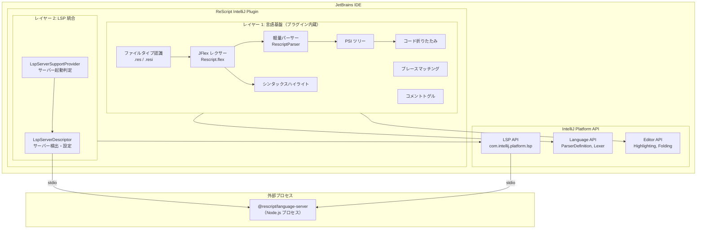
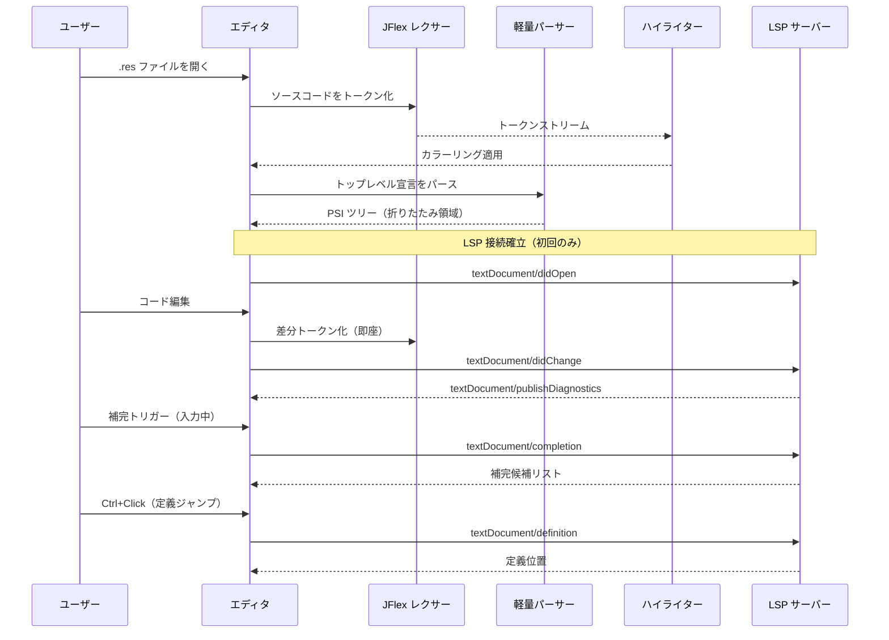
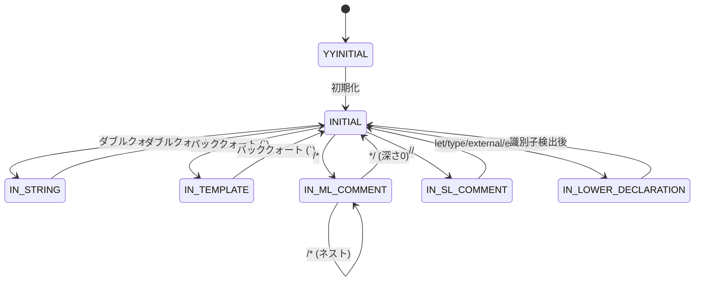
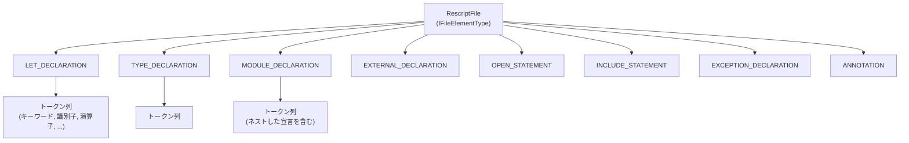

# 機能設計書 (Functional Design)

## 1. システム構成図

### 全体アーキテクチャ



### データフロー



## 2. コンポーネント設計

### 2.1 言語登録コンポーネント

#### RescriptLanguage

| 項目 | 内容 |
|---|---|
| 継承元 | `com.intellij.lang.Language` |
| 役割 | ReScript 言語の一意識別子をプラットフォームに登録 |
| パターン | シングルトン（`companion object` の `INSTANCE`） |

#### RescriptFileType / RescriptInterfaceFileType

| 項目 | RescriptFileType | RescriptInterfaceFileType |
|---|---|---|
| 拡張子 | `.res` | `.resi` |
| 説明 | ReScript source file | ReScript interface file |
| アイコン | `rescript-file.svg` | `rescript-interface.svg` |
| 言語 | `RescriptLanguage` | `RescriptLanguage` |
| パターン | シングルトン | シングルトン |

### 2.2 レキシカル解析コンポーネント

#### Rescript.flex（JFlex 定義）

**レクサー状態遷移図:**



**トークンカテゴリ一覧:**

| カテゴリ | トークン例 | TokenSet |
|---|---|---|
| キーワード | `let`, `type`, `module`, `switch`, `if`, `else`, `async`, `await` | `KEYWORDS` |
| キーワード演算子 | `mod`, `land`, `lor`, `lxor`, `lsl`, `lsr`, `asr` | `KEYWORDS` |
| 組み込み | `unit`, `ref`, `raise`, `option`, `None`, `Some` | — |
| 識別子 | 小文字開始 (`LIDENT`), 大文字開始 (`UIDENT`) | — |
| 数値リテラル | 整数 (`INT_LITERAL`), 浮動小数点 (`FLOAT_LITERAL`) | `NUMBERS` |
| 文字列リテラル | 通常文字列, テンプレート文字列, 文字リテラル | `STRINGS` |
| コメント | `// ...`, `/* ... */` | `COMMENTS` |
| 演算子 | `+`, `-`, `=>`, `->`, `\|>`, `==`, `===` | `OPERATORS` |
| 区切り文字 | `(`, `)`, `{`, `}`, `[`, `]`, `,`, `.`, `;` | — |
| デコレータ | `@annotation` | — |
| 型引数 | `'a`, `'b` | — |
| ポリモーフィックバリアント | `#Tag` | — |

**特殊処理:**

- **ネストコメント**: `commentDepth` カウンタで `/* /* ... */ */` を正しく処理
- **テンプレート文字列**: バッククォート内の `${...}` 補間を認識
- **宣言コンテキスト**: `let`/`type` 等の後の識別子を正しく分類するための状態遷移

#### RescriptLexer

| 項目 | 内容 |
|---|---|
| 継承元 | `com.intellij.lexer.FlexAdapter` |
| 役割 | JFlex 生成の `RescriptFlexLexer` を IntelliJ Lexer API にアダプト |
| パターン | アダプターパターン |

#### RescriptTokenTypes

| 項目 | 内容 |
|---|---|
| 役割 | 全 `IElementType` トークン定数と `TokenSet` を定義 |
| トークン数 | 70+ |
| 主要 TokenSet | `KEYWORDS`, `COMMENTS`, `STRINGS`, `NUMBERS`, `OPERATORS`, `TOP_LEVEL_KEYWORDS` |

### 2.3 パーサーコンポーネント

#### RescriptParser

| 項目 | 内容 |
|---|---|
| 継承元 | `com.intellij.lang.PsiParser` |
| 役割 | トップレベル宣言のみを認識する軽量パーサー |
| パース対象 | `let`, `type`, `module`, `external`, `open`, `include`, `exception`, `@annotation` |
| パース非対象 | 式、JSX、型式、パターンマッチ（LSP に委譲） |

**パース戦略:**

```
ファイル
├── @annotation          → ANNOTATION ノード
├── let [rec] name ...   → LET_DECLARATION ノード
├── type [rec] name ...  → TYPE_DECLARATION ノード
├── module [type] Name   → MODULE_DECLARATION ノード
├── external name ...    → EXTERNAL_DECLARATION ノード
├── open ModulePath      → OPEN_STATEMENT ノード
├── include ModulePath   → INCLUDE_STATEMENT ノード
├── exception Name ...   → EXCEPTION_DECLARATION ノード
└── (その他のトークン)    → スキップ
```

**宣言終端の検出:**

パーサーは波括弧・丸括弧の深さ（depth）を追跡し、以下の条件で宣言の終端を判定する:
- 深さ 0 で次のトップレベルキーワードまたは `@` に到達
- 深さ 0 で `}` に到達（モジュール終端）
- ファイル末尾に到達

#### RescriptParserDefinition

| 項目 | 内容 |
|---|---|
| 継承元 | `com.intellij.lang.ParserDefinition` |
| 役割 | レクサー・パーサーの生成、ファイルノード型の定義 |
| 登録 | `plugin.xml` の `lang.parserDefinition` |

### 2.4 PSI データモデル

#### PSI ツリー構造



#### PSI 要素型一覧

| 要素型 | 対応する宣言 | 用途 |
|---|---|---|
| `LET_DECLARATION` | `let` / `let rec` バインディング | 折りたたみ、ストラクチャービュー |
| `TYPE_DECLARATION` | `type` / `type rec` 定義 | 折りたたみ、ストラクチャービュー |
| `MODULE_DECLARATION` | `module` / `module type` / `module rec` 定義 | 折りたたみ、ストラクチャービュー |
| `EXTERNAL_DECLARATION` | `external` バインディング（FFI） | 折りたたみ |
| `OPEN_STATEMENT` | `open` ディレクティブ | — |
| `INCLUDE_STATEMENT` | `include` ディレクティブ | — |
| `EXCEPTION_DECLARATION` | `exception` 定義 | 折りたたみ |
| `ANNOTATION` | `@decorator` | — |

### 2.5 シンタックスハイライトコンポーネント

#### RescriptSyntaxHighlighter

| 項目 | 内容 |
|---|---|
| 継承元 | `com.intellij.openapi.fileTypes.SyntaxHighlighterBase` |
| 役割 | トークンタイプから `TextAttributesKey` へのマッピング |

**カラーマッピング:**

| TextAttributesKey | 対象トークン | デフォルトスタイル |
|---|---|---|
| `KEYWORD` | 全キーワード | `DefaultLanguageHighlighterColors.KEYWORD` |
| `STRING` | 文字列リテラル、テンプレート | `DefaultLanguageHighlighterColors.STRING` |
| `NUMBER` | 整数、浮動小数点 | `DefaultLanguageHighlighterColors.NUMBER` |
| `LINE_COMMENT` | `// ...` | `DefaultLanguageHighlighterColors.LINE_COMMENT` |
| `BLOCK_COMMENT` | `/* ... */` | `DefaultLanguageHighlighterColors.BLOCK_COMMENT` |
| `OPERATOR` | 演算子 | `DefaultLanguageHighlighterColors.OPERATION_SIGN` |
| `BRACES` | `{`, `}` | `DefaultLanguageHighlighterColors.BRACES` |
| `BRACKETS` | `[`, `]` | `DefaultLanguageHighlighterColors.BRACKETS` |
| `PARENS` | `(`, `)` | `DefaultLanguageHighlighterColors.PARENTHESES` |
| `DOT` | `.` | `DefaultLanguageHighlighterColors.DOT` |
| `COMMA` | `,` | `DefaultLanguageHighlighterColors.COMMA` |
| `SEMICOLON` | `;` | `DefaultLanguageHighlighterColors.SEMICOLON` |
| `TYPE_ARG` | `'a`, `'b` 等 | `DefaultLanguageHighlighterColors.METADATA` |
| `POLY_VARIANT` | `#Tag` | `DefaultLanguageHighlighterColors.CONSTANT` |
| `MODULE_NAME` | 大文字開始識別子 | `DefaultLanguageHighlighterColors.CLASS_NAME` |
| `ANNOTATION` | `@decorator` | `DefaultLanguageHighlighterColors.METADATA` |
| `BAD_CHAR` | 不正文字 | `HighlighterColors.BAD_CHARACTER` |

### 2.6 コード折りたたみコンポーネント

#### RescriptFoldingBuilder

| 項目 | 内容 |
|---|---|
| 継承元 | `com.intellij.lang.folding.FoldingBuilderEx` |
| 折りたたみ対象 | 複数行のブロックコメント、`{` を含む複数行宣言 |

**折りたたみルール:**

| 対象 | 条件 | プレースホルダー |
|---|---|---|
| ブロックコメント | `BLOCK_COMMENT` が複数行 | `/* ... */` |
| モジュール宣言 | `MODULE_DECLARATION` が `{` を含み複数行 | `module ... { ... }` |
| let/type 宣言 | 宣言が `{` を含み複数行 | `{...}` |
| デフォルト | 上記以外の折りたたみ対象 | `{...}` |

### 2.7 ブレースマッチングコンポーネント

#### RescriptBraceMatcher

| 項目 | 内容 |
|---|---|
| 継承元 | `com.intellij.lang.PairedBraceMatcher` |

**ブレースペア定義:**

| 開始 | 終了 | 構造的 |
|---|---|---|
| `{` (`LBRACE`) | `}` (`RBRACE`) | Yes |
| `[` (`LBRACKET`) | `]` (`RBRACKET`) | No |
| `(` (`LPAREN`) | `)` (`RPAREN`) | No |

### 2.8 コメントコンポーネント

#### RescriptCommenter

| 項目 | 内容 |
|---|---|
| 継承元 | `com.intellij.lang.Commenter` |
| 行コメント | `// ` |
| ブロックコメント開始 | `/* ` |
| ブロックコメント終了 | ` */` |

### 2.9 LSP 統合コンポーネント

#### RescriptLspServerSupportProvider

| 項目 | 内容 |
|---|---|
| 継承元 | `com.intellij.platform.lsp.api.LspServerSupportProvider` |
| 役割 | ファイルオープン時に LSP サーバーの起動判定を行う |
| トリガー条件 | ファイル拡張子が `.res` または `.resi` |

#### RescriptLspServerDescriptor

| 項目 | 内容 |
|---|---|
| 継承元 | `com.intellij.platform.lsp.api.ProjectWideLspServerDescriptor` |
| 役割 | LSP サーバーの検出、起動コマンド構築、対象ファイル判定 |
| スコープ | プロジェクト全体 |

**サーバー検出戦略（優先順位順）:**

```mermaid
flowchart TD
    A[LSP サーバー検出開始] --> B{node_modules/.bin/<br/>rescript-language-server<br/>が存在する?}
    B -->|Yes| C[実行ファイルパスを使用]
    B -->|No| D{親ディレクトリの<br/>node_modules/.bin/<br/>に存在する?}
    D -->|Yes| C
    D -->|No| E{node_modules/<br/>@rescript/language-server/<br/>out/cli.js が存在する?}
    E -->|Yes| F[node で .js を実行]
    E -->|No| G{which/where で<br/>グローバルインストールを検索}
    G -->|Found| C
    G -->|Not Found| H[サーバー起動失敗<br/>LSP 機能無効]

    C --> I[コマンド構築:<br/>server_path --stdio]
    F --> J[コマンド構築:<br/>node cli.js --stdio]
    I --> K[stdio 経由で LSP 接続]
    J --> K
```

**LSP プロトコル対応:**

| LSP メソッド | IDE 機能 |
|---|---|
| `textDocument/completion` | コード補完 |
| `textDocument/definition` | 定義ジャンプ (Ctrl+B / Ctrl+Click) |
| `textDocument/hover` | ホバードキュメント |
| `textDocument/references` | 参照検索 (Find Usages) |
| `textDocument/publishDiagnostics` | リアルタイム診断（エラー・警告） |
| `textDocument/inlayHint` | インレイヒント（型注釈） |
| `textDocument/didOpen` | ファイルオープン通知 |
| `textDocument/didChange` | ファイル変更通知 |
| `textDocument/didClose` | ファイルクローズ通知 |
| `textDocument/semanticTokens/full` | セマンティックハイライティング |

#### RescriptSemanticTokensSupport

| 項目 | 内容 |
|---|---|
| 継承元 | `com.intellij.platform.lsp.api.customization.LspSemanticTokensSupport` |
| 役割 | LSP セマンティックトークンタイプから `TextAttributesKey` へのマッピング |
| 登録方法 | `RescriptLspServerDescriptor.lspCustomization` 経由 |

**セマンティックトークンマッピング:**

| LSP トークンタイプ | ReScript での意味 | TextAttributesKey |
|---|---|---|
| `variable` | 変数・パラメータ | `RESCRIPT_SEMANTIC_VARIABLE` |
| `type` | 型名 | `RESCRIPT_SEMANTIC_TYPE` |
| `namespace` | モジュール名 | `RESCRIPT_SEMANTIC_NAMESPACE` |
| `enumMember` | バリアント・コンストラクタ | `RESCRIPT_SEMANTIC_ENUM_MEMBER` |
| `property` | レコードフィールド | `RESCRIPT_SEMANTIC_PROPERTY` |
| `interface` | JSX HTML 要素（div, span等） | `RESCRIPT_SEMANTIC_INTERFACE` |
| `operator` | 演算子 | `RESCRIPT_SEMANTIC_OPERATOR` |
| `modifier` | JSX ブラケット（<, >, />） | `RESCRIPT_SEMANTIC_MODIFIER` |

レクサーベースのハイライティングの上にセマンティック情報が重畳される。LSP サーバー未接続時はレクサーハイライトのみで動作する。

## 3. Extension Point 登録マップ

`plugin.xml` で登録される全 extension point の一覧:

| Extension Point | 実装クラス | 用途 | 状態 |
|---|---|---|---|
| `com.intellij.fileType` | `RescriptFileType` | `.res` ファイルタイプ登録 | 実装済み |
| `com.intellij.fileType` | `RescriptInterfaceFileType` | `.resi` ファイルタイプ登録 | 実装済み |
| `com.intellij.lang.parserDefinition` | `RescriptParserDefinition` | レクサー・パーサー登録 | 実装済み |
| `com.intellij.lang.syntaxHighlighterFactory` | `RescriptSyntaxHighlighterFactory` | ハイライト登録 | 実装済み |
| `com.intellij.lang.braceMatcher` | `RescriptBraceMatcher` | ブレースマッチング登録 | 実装済み |
| `com.intellij.lang.commenter` | `RescriptCommenter` | コメントトグル登録 | 実装済み |
| `com.intellij.lang.foldingBuilder` | `RescriptFoldingBuilder` | コード折りたたみ登録 | 実装済み |
| `com.intellij.lang.psiStructureViewFactory` | `RescriptStructureViewFactory` | ストラクチャービュー登録 | 実装済み |
| `com.intellij.colorSettingsPage` | `RescriptColorSettingsPage` | ハイライト色設定 UI | 実装済み |
| `com.intellij.additionalTextAttributes` | `RescriptDarcula.xml` / `RescriptDefault.xml` | テーマ別カラースキーム | 実装済み |
| `com.intellij.iconProvider` | `RescriptJsonIconProvider` | rescript.json アイコン表示 | 実装済み |
| `com.intellij.configurationType` | `RescriptRunConfigurationType` | 実行構成登録 | 実装済み |
| `com.intellij.langCodeStyleSettingsProvider` | `RescriptCodeStyleSettingsProvider` | コードスタイル設定 | 実装済み |
| `com.intellij.lang.quoteHandler` | `RescriptQuoteHandler` | スマート引用符補完 | 実装済み |
| `com.intellij.lineIndentProvider` | `RescriptLineIndentProvider` | インデント制御 | 実装済み |
| `com.intellij.breadcrumbsInfoProvider` | `RescriptBreadcrumbsProvider` | パンくずナビゲーション | 実装済み |
| `com.intellij.renameHandler` | `RescriptRenameHandler` | リネームリファクタリング | 実装済み |
| `com.intellij.lang.namesValidator` | `RescriptNamesValidator` | 名前バリデーション | 実装済み |
| `com.intellij.projectConfigurable` | `RescriptConfigurable` | プロジェクト設定 UI | 実装済み |
| `com.intellij.projectService` | `RescriptProjectSettings` | プロジェクト設定永続化 | 実装済み |
| `com.intellij.platform.lsp.serverSupportProvider` | `RescriptLspServerSupportProvider` | LSP サーバー登録 | 実装済み |
| `com.intellij.todoIndexer` | `RescriptTodoIndexer` | TODO インデクシング | 実装済み |
| `com.intellij.gotoSymbolContributor` | `RescriptSymbolContributor` | Go to Symbol | 実装済み |
| `com.intellij.formattingService` | `RescriptFormattingService` | 外部フォーマッタ連携 | 実装済み |
| `com.intellij.localInspection` | `RescriptDuplicateOpenInspection` | 重複 open 検出 | 実装済み |
| `com.intellij.localInspection` | `RescriptEmptyModuleInspection` | 空モジュール検出 | 実装済み |
| `com.intellij.localInspection` | `RescriptMissingConfigInspection` | rescript.json 未検出警告 | 実装済み |
| `<action>` | `RescriptSwitchFileAction` | `.res`/`.resi` ファイル切り替え (Alt+O) | 実装済み |
| `com.intellij.defaultLiveTemplates` | `liveTemplates/ReScript.xml` | Live Templates (15スニペット) | 実装済み |
| `com.intellij.internalFileTemplate` | `ReScript Module` / `ReScript Interface` / `ReScript Component` | ファイルテンプレート登録 | 実装済み |
| `<action>` | `RescriptCreateFileAction` | New > ReScript File アクション | 実装済み |
| `com.intellij.spellchecker.support` | `RescriptSpellcheckingStrategy` | スペルチェック | 実装済み |
| `com.intellij.gotoRelatedProvider` | `RescriptGotoRelatedProvider` | Go to Related (.res/.resi/.js) | 実装済み |

## 4. ファイル構成と依存関係

```mermaid
graph LR
    subgraph Core["コア"]
        LANG[RescriptLanguage]
        FT[RescriptFileTypes]
        ICON[RescriptIcons]
    end

    subgraph Lexer["レキシカル解析"]
        FLEX[Rescript.flex]
        FLEXLEXER[RescriptFlexLexer<br/>自動生成]
        LEXER[RescriptLexer]
        TOKENS[RescriptTokenTypes]
    end

    subgraph Parser["パーサー"]
        PARSER[RescriptParser]
        PARSERDEF[RescriptParserDefinition]
        PSI_ELEM[RescriptPsi<br/>要素型定義]
    end

    subgraph Highlight["ハイライト"]
        HL[RescriptSyntaxHighlighter]
        HLF[RescriptSyntaxHighlighterFactory]
        BM[RescriptBraceMatcher]
    end

    subgraph Features["エディタ機能"]
        FOLD[RescriptFoldingBuilder]
        COMM[RescriptCommenter]
    end

    subgraph LSP["LSP 統合"]
        LSPP[RescriptLspServerSupportProvider]
        LSPD[RescriptLspServerDescriptor]
        SEMTOK[RescriptSemanticTokensSupport]
    end

    FLEX -->|JFlex 生成| FLEXLEXER
    LEXER --> FLEXLEXER
    LEXER --> TOKENS
    PARSERDEF --> LEXER
    PARSERDEF --> PARSER
    PARSER --> TOKENS
    PARSER --> PSI_ELEM
    HL --> TOKENS
    HLF --> HL
    BM --> TOKENS
    FOLD --> PSI_ELEM
    LSPP --> LSPD
    LSPD --> SEMTOK
    SEMTOK --> HL
    LSPD --> FT
    FT --> LANG
    FT --> ICON
    PARSERDEF --> LANG

## 5. rescript-vscode との機能対比表

rescript-vscode（公式 VS Code 拡張）と本プラグインの機能カバレッジ比較。

### エディタ基本機能

| 機能 | rescript-vscode | 本プラグイン | 備考 |
|---|---|---|---|
| シンタックスハイライト | TextMate grammar | JFlex レクサー | 実装方式は異なるが同等のカバレッジ |
| セマンティックハイライト | LSP semantic tokens | LSP semantic tokens | 同等 |
| コード折りたたみ | VS Code 標準 | `RescriptFoldingBuilder` | 同等 |
| ブレースマッチング | VS Code 標準 | `RescriptBraceMatcher` | 同等 |
| コメントトグル | VS Code 標準 | `RescriptCommenter` | 同等 |
| スマート引用符 | VS Code 標準 | `RescriptQuoteHandler` | 同等 |
| パンくずナビゲーション | VS Code 標準 | `RescriptBreadcrumbsProvider` | 同等 |
| カラースキーム設定 | VS Code テーマ | `RescriptColorSettingsPage` | 同等 |

### LSP 連携機能

| 機能 | rescript-vscode | 本プラグイン | 備考 |
|---|---|---|---|
| コード補完 | LSP completion | LSP completion | 同等 |
| 定義ジャンプ | LSP definition | LSP definition | 同等 |
| ホバードキュメント | LSP hover | LSP hover | 同等 |
| 参照検索 | LSP references | LSP references | 同等 |
| リアルタイム診断 | LSP diagnostics | LSP diagnostics | 同等 |
| インレイヒント | LSP inlay hints | LSP inlay hints | 同等 |
| リネーム | LSP rename | LSP rename | 同等 |
| Signature Help | LSP signatureHelp | **未実装** | IntelliJ LSP API で自動提供の可能性あり |
| Code Lens | LSP codeLens | **未実装** | IntelliJ LSP API の対応状況要確認 |

### IDE 統合機能

| 機能 | rescript-vscode | 本プラグイン | 備考 |
|---|---|---|---|
| ストラクチャービュー | VS Code Outline | `RescriptStructureViewFactory` | 同等 |
| Go to Symbol | VS Code symbols | `RescriptSymbolContributor` | 同等 |
| コードフォーマット | `rescript format` CLI | `RescriptFormattingService` | 同等 |
| 実行構成 | VS Code tasks.json | `RescriptRunConfigurationType` | 同等 |
| TODO インデクシング | — | `RescriptTodoIndexer` | 本プラグイン独自 |
| コードインスペクション | — | `RescriptDuplicateOpenInspection` 等 | 本プラグイン独自 |
| プロジェクト設定 UI | VS Code settings.json | `RescriptConfigurable` | 同等 |

### 未実装機能（rescript-vscode にあり、本プラグインに未実装）

| 機能 | rescript-vscode での実装 | 優先度 | 備考 |
|---|---|---|---|
| JSON Schema (`rescript.json`) | 内蔵スキーマ定義 | P1 | `jsonSchemaProviderFactory` |
| `%raw()` JS ハイライト | TextMate embedded grammar | P1 | `MultiHostInjector` |
| インターフェースファイル生成 | LSP `textDocument/createInterface` | P2 | LSP カスタムリクエスト |
| コンパイル済み JS を開く | LSP `textDocument/openCompiled` | P2 | LSP カスタムリクエスト |
| ビルドステータス表示 | StatusBar + `.compiler.log` 監視 | P2 | `StatusBarWidget` |
| reanalyze 統合 | reanalyze バイナリ起動 | P3 | デッドコード・未処理例外分析 |
| Markdown ReScript ハイライト | TextMate embedded grammar | P3 | `LanguageInjector` |
| Paste as JSON.t/JSX | クリップボード変換コマンド | P3 | `PasteProvider` |
| `//#region` 折りたたみ | VS Code 標準 region markers | P3 | `FoldingBuilder` 拡張 |
| Incremental Type Checking 設定 | VS Code 設定 | P3 | Settings UI 拡張 |
